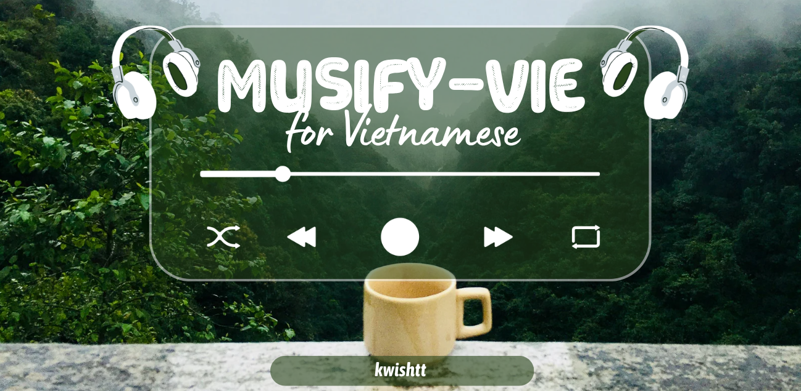
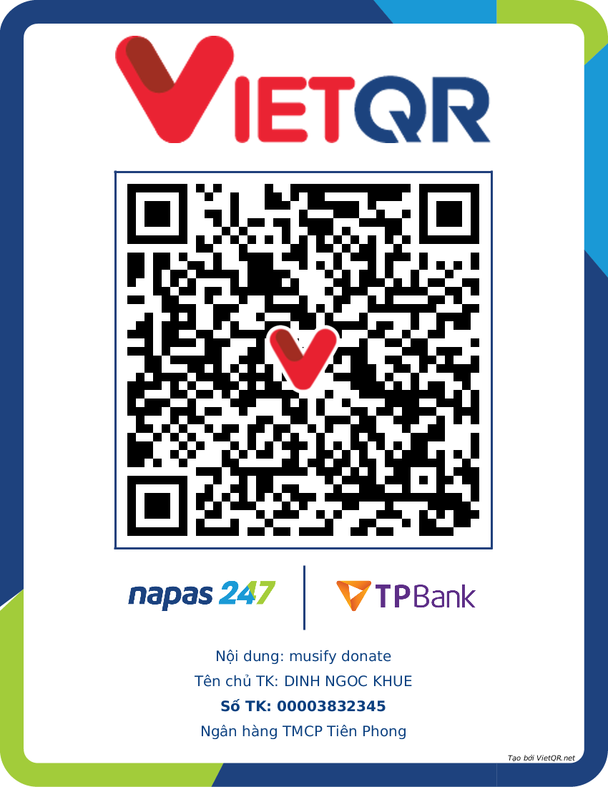

# Musify-Vie

**A Refined Music Streaming Experience**
*(Optimized for Vietnamese Localization and Performance)*

---

<strong>Dành cho người dùng Việt Nam (Vietnamese Context)</strong>

### Tổng quan
**Musify-Vie** là phiên bản sửa đổi (fork) từ dự án mã nguồn mở [Musify](https://github.com/gokadzev/Musify), tập trung vào việc cải thiện trải nghiệm người dùng tại Việt Nam thông qua việc bản địa hóa toàn diện và tinh chỉnh các thuật toán cốt lõi.

### Các tính năng chính
*   **Bản địa hóa toàn diện (Localization):** Giao diện và thông báo hệ thống được chuyển ngữ sang Tiếng Việt hoàn chỉnh, đảm bảo trải nghiệm người dùng mượt mà và trực quan.
*   **Tối ưu hóa thuật toán gợi ý (Smart Recommendations):** Hệ thống đề xuất bài hát được điều chỉnh để giảm thiểu sự lặp lại và tăng cường độ phù hợp dựa trên lịch sử nghe nhạc và bối cảnh địa phương.
*   **Phát nhạc liên tục (Infinite Playback):** Cơ chế tự động phát được cải tiến, đảm bảo chuyển tiếp liền mạch sang các bài hát gợi ý khi danh sách phát hiện tại kết thúc.
*   **Tối ưu hóa tìm kiếm:** Tăng độ chính xác cho các truy vấn tìm kiếm, đặc biệt ưu tiên nội dung và nghệ sĩ Việt Nam.
*   **Tiện ích mở rộng:** Tích hợp SponsorBlock để tự động bỏ qua các phân đoạn quảng cáo trong luồng âm thanh, hỗ trợ tải xuống ngoại tuyến và hiển thị lời bài hát đồng bộ.

### Hỗ trợ dự án
Nếu bạn đánh giá cao những cải tiến trong phiên bản này, bạn có thể ủng hộ quá trình phát triển thông qua chuyển khoản ngân hàng (Mã QR có sẵn trong phần Cài đặt của ứng dụng):

  

---

## Overview

**Musify-Vie** is a specialized fork of the [Musify](https://github.com/gokadzev/Musify) application, engineered to deliver a superior streaming experience with a strong focus on localization and algorithmic enhancements suited for the Vietnamese market.

## Key Modifications

*   **Vietnamese Localization:** Complete language support for the user interface and system messages, ensuring accessibility for native speakers.
*   **Enhanced Recommendation Engine:** A refined algorithm that prioritizes relevant tracks based on comprehensive listening history and avoids repetitive shuffling.
*   **Infinite Playback:** Improved autoplay functionality ensures a seamless transition to recommended tracks immediately upon queue completion.
*   **Search Optimization:** Tuned search logic to prioritize localized content and improve overall query accuracy.
*   **Extended Features:** Includes built-in SponsorBlock integration for uninterrupted listening, robust offline playback capabilities, and synchronized lyrics support.

## Download

The latest installable package (APK) can be downloaded from the **Releases** section of this repository:

## Screenshots

| <!-- Placeholder --> | <!-- Placeholder --> |
|:---:|:---:|
|  |  |

---

## Support

Contributions to the maintenance and development of this fork are welcome. You can support via Bank Transfer (details available inside the App Settings):

  

Alternatively, you may support the original developer (Gokadzev) at: [Ko-fi](https://ko-fi.com/gokadzev)

## License

Musify-Vie is distributed under the **GPL v3.0** license. Please refer to the [LICENSE](LICENSE) file for further details.

**Credits:**
Based on the original [Musify](https://github.com/gokadzev/Musify) by Valeri Gokadze.
Modifications and maintenance by **ktmjn (kwishtt)**.
